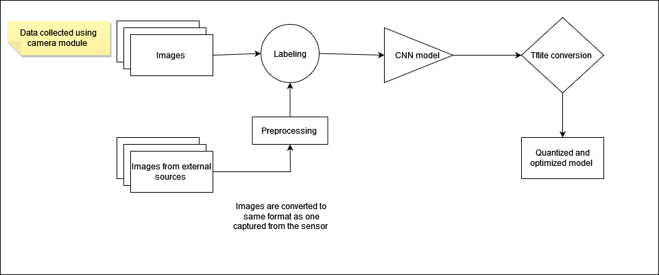

# Accessible Self-Checkout: Automating Fruit Recognition

One-sentence pitch: on-device fruit classification on a Raspberry Pi 3B+ to remove manual produce entry at self-checkout, aimed at making it more accessible.

## Overview
Problem, approach, and what's implemented. Be clear that it's a course project (CEN/BMI 598, ASU).

## My contributions
Specific to you, since this was a team of three.

## System
Pipeline diagrams (assets/training_pipeline.png, deployment_pipeline.png).
Hardware: Raspberry Pi 3B+, Camera Module v1.

## Results
Results table + confusion matrix. State limits honestly (3 classes, small dataset).

## Repo structure
Short tree.

## Reproduce
1. Environment setup
2. Data (where to get it, expected folder layout)
3. Train: notebooks/train_fruit_classifier.ipynb
4. Run on Pi: python src/pi_inference.py --model models/fruit_classifier.tflite

## Limitations & future work
Audio output not implemented, no user testing, only 3 fruits, etc.

## Credits
Teammates, TensorFlow Lite example, dataset sources.

## Paper
docs/manuscript.pdf
